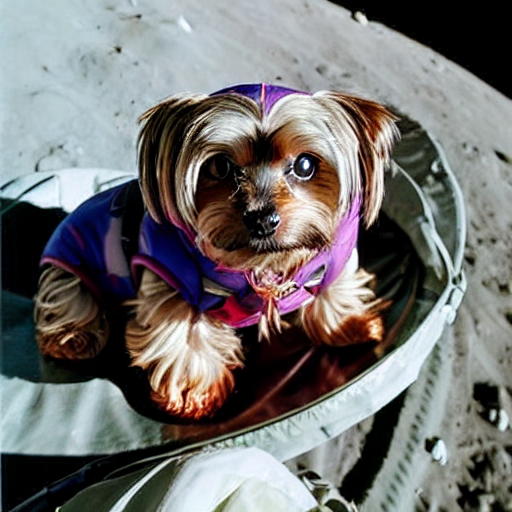

# My Personal Website

## Thank you for visiting my personal website! ⸜( ˙˘˙)⸝

I'm currently a Data Scientist at RBC Capital Markets under the QTS Investment Banking Alternative Data and AI Team. I am also a Senior Data Quality Specialist at Cohere.

Outside of these roles, I *endeavour* to contribute as much as possible to any open-source ML community events, libraries, and projects. I also sometimes make YouTube videos and TikToks discussing anything ML related.

This website is a collection of some projects I really enjoyed working on and found interesting. I hope you find them interesting too!

### Projects

#### Text2Sql

Fine-tuned an LLM on synthetic data to resolve natural language queries about an SQLite database by generating an SQL Query and interpreting the results.

#### Dreambella -- a Dreambooth fine-tuned diffusion model for my dog Bella

Fine-tuned a diffusion model with Dreambooth to output

#### DotaLLM

Trained a YOLO model for enemy detection and prompted an LLM to decide where to move and what to attack.

## Contact
- Email: [asusevski@gmail.com](mailto:asusevski@gmail.com)
- [LinkedIn](https://www.linkedin.com/in/asusevski/)
- [GitHub](https://github.com/asusevski)
- [HuggingFace](https://huggingface.co/asusevski)
- [YouTube](https://www.youtube.com/@asusevski)
